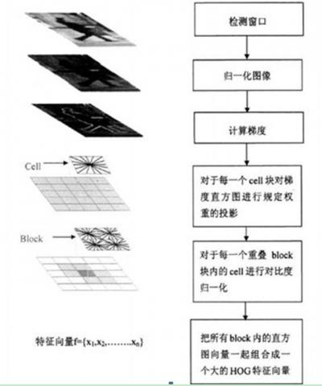
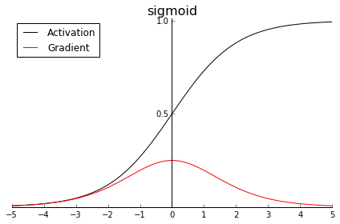
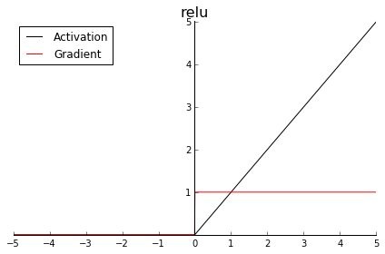
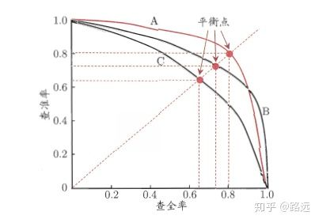

# 深度学习
## 滤波器与卷积核
这两个术语之间有着本质的区别：仅在 `1` 通道的情况下，滤波器和内核这两个术语等价，在一般情况下，它们是不同的。**每个过滤器实际上是卷积核的集合**，图层的每个输入通道都有一个卷积核，并且是唯一的。
## 卷积层和池化输出大小计算
> 不管是TensorFlow、Keras、Caffe还是Pytorch，其卷积层和池化层的参数默认值可能有所不同，但是最终的卷积输出大小计算公式是一样的
### CNN中术语解释
`CNN`网络的主要参数有下面这么几个：

+ 卷积核Kernal（在Tensorflow中称为filter）；
+ 填充Padding；
+ 滑动步长Strides；
+ 池化核Kernal（在Tensorflow中称为filter）；
+ 通道数Channels。

### 卷积输出大小计算
1，图片经卷积 `Conv2D` 后**输出大小计算公式**如下：
$N = (W − F + 2P )/S+1$，**这里表示的是向下取整再加1**。
+ 输入图片大小 `W×W`（默认输入尺寸为正方形）
+ Filter大小 `F×F`
+ 步长 `S`
+ padding的像素数 `P`
+ 输出特征图大小 `N×N`

输出通道数 = 卷积核/池化核数量


2，反卷积 `Conv2DTranspose` 得到的图片大小计算方式：
**反卷积的大小是由卷积核大小与滑动步长决定**， in是输入大小， k是卷积核大小， s是滑动步长， padding的像素数 P, out是输出大小。
得到 $out = (in - 1) * s -2p + k$，还有另外一个写法：$W = (N - 1)*S - 2P + F$。

（`反卷积`也称为转置卷积，一般主要用来还原feature map的尺寸大小，在 cnn 可视化，fcn 中达到 pixel classification，以及 gan中从特征生成图像都需要用到反卷积的操作。）

反卷积输出结果计算实例。例如，输入：2x2， 卷积核：4x4， 滑动步长：3，填充像素为0， 输出：7x7 ，其计算过程就是， (2 - 1) * 3 + 4 = 7。

3，池化层如果设置为不填充像素（对于Pytorch，设置参数`padding = 0`，对于Keras/TensorFlow，设置参数`padding="valid"`），池化得到的特征图大小计算方式: $N=(W-F)/S+1$，这里表示的是向下取整再加1。

**Pytorch 和 tensorflow 的卷积和池化函数，在 `0/"valid"` 条件下卷积和池化都向下取整**。**在实际设计的卷积神经网络中，卷积层一般填充像素(`same`)，池化层一般不填充像素(`valid`)**？注意：`stride`为 1 的时候，当`kernel`为 3 `padding`为 1 或者`kernel`为 5 `padding`为2，这种情况可直接得出卷积前后尺寸不变。

### 理解边界效应与填充padding
如果希望输出特征图的空间维度
`Keras/TensorFlow` 设置卷积层的过程中可以设置 padding 参数值为 “valid” 或 “same”。“valid” 代表只进行有效的卷积，对边界数据不处理。“same” 代表 TensorFlow会自动对原图像进行补零（表示卷积核可以停留在图像边缘），也就是自动设置`padding` 值让输出与输入形状相同**。

### 参考资料
+ [CNN中的参数解释及计算](https://flat2010.github.io/2018/06/15/%E6%89%8B%E7%AE%97CNN%E4%B8%AD%E7%9A%84%E5%8F%82%E6%95%B0/)

## Pytorch、Keras 的卷积层和池化层函数

+ 注意：`Pytorc` h的卷积层和池化层的输入 `shape` 格式为 **(N,C,H,W)**，`Keras` 的卷积层和池化层的输入 `shape` 格式为 **(N,H,W,C)**
+ 注意：`Pytorch、Keras` 的卷积层和池化层函数，**padding参数值都默认为不填充像素**，默认值为 `0`和 `valid`。
  
## Pytorch 和 Keras 的池化层函数

### torch.nn.MaxPool2d

```python
class torch.nn.MaxPool2d(kernel_size, stride=None, padding=0, dilation=1, return_indices=False, ceil_mode=False)
```

二维池化层, 默认输入的尺度是`(N, C_in,H,W)`，输出尺度`（N,C_out,H_out,W_out）`。

**主要参数解释**：
+ `kernel_size`(int or tuple) - max pooling的窗口大小
+ `stride`(int or tuple, optional) - max pooling的窗口移动的步长。**默认值是kernel_size**
+ `padding`(int or tuple, optional) - **默认值为0，即不填充像素**，输入的每一条边补充0的层数
+ `ceil_mode` - **默认值为 False**，默认向下取整，如果等于True，计算输出信号大小的时候，会使用向上取整。

**example**

```python
import torch
import torch.nn as nn
import torch.autograd as autograd
# 大小为3，步幅为2的正方形窗口池
m = nn.MaxPool2d(kernel_size=3, stride=2, padding=1)
# pool of non-square window
input = autograd.Variable(torch.randn(20, 16, 50, 32))
output = m(input)
print(output.shape)  # torch.Size([20, 16, 25, 16])
```

### keras.layers.MaxPooling2D

```python
keras.layers.MaxPooling2D(pool_size=(2, 2), strides=None, padding='valid', data_format=None)
```

对于2D空间数据的最大池化。默认输入尺寸是 `(batch_size, rows, cols, channels)` 的 4D 张量，默认输出尺寸是 `(batch_size, pooled_rows, pooled_cols, channels)` 的 4D 张量。

+ `padding = valid`：池化层输出的特征图大小为：$N=(W-F)/S+1$, **这里表示的是向下取整再加1**。
+ `padding = same`: 池化层输出的特征图大小为$N = W/S$, **这里表示向上取整**。

**主要参数解释**

+ `pool_size`: 整数，或者 2 个整数表示的元组， 沿（垂直，水平）方向缩小比例的因数。 （2，2）会把输入张量的两个维度都缩小一半。 如果只使用一个整数，那么两个维度都会使用同样的窗口长度。
+ `strides`: 整数，2 个整数表示的元组，或者是 None。 表示步长值。 如果是 None，那么默认值是 pool_size。
+ `padding`: "valid" 或者 "same" （区分大小写）。
+ `data_format`: 字符串，`channels_last` (默认)或 `channels_first` 之一。 表示输入各维度的顺序。 `channels_last` 代表尺寸是 `(batch, height, width, channels)` 的输入张量， 而 `channels_first` 代表尺寸是 `(batch, channels, height, width)` 的输入张量。 默认值根据 `Keras` 配置文件 `~/.keras/keras.json` 中的 `image_data_format` 值来设置。如果还没有设置过，那么**默认值就是 `"channels_last"`**。

## Pytorch 和 Keras 的卷积层函数

### torch.nn.Conv2d
```python
class torch.nn.Conv2d(in_channels, out_channels, kernel_size, stride=1, padding=0, dilation=1, groups=1, bias=True)
```

二维卷积层, 输入的尺度是`(N, C_in,H,W)`，输出尺度`（N,C_out,H_out,W_out）`。

**主要参数解释**
+ `in_channels`(int) – 输入信号的通道
+ `out_channels`(int) – 卷积产生的通道
+ `kerner_size`(int or tuple) - 卷积核的尺寸
+ `stride`(int or tuple, optional) - 卷积步长，默认值为1
+ `padding`(int or tuple, optional) - 输入的每一条边补充0的层数，默认不填充
+ `dilation`(int or tuple, optional) – 卷积核元素之间的间距
+ `groups`(int, optional) – 从输入通道到输出通道的阻塞连接数
+ `bias`(bool, optional) - 如果bias=True，添加偏置

**example**

```python
######## Pytorch卷积层输出大小验证
import torch
import torch.nn as nn
import torch.autograd as autograd
# With square kernels and equal stride
# output_shape: height = (50-3)/2+1 = 24.5，卷积向下取整，所以 height=24.
m = nn.Conv2d(16, 33, 3, stride=2)
# # non-square kernels and unequal stride and with padding
# m = nn.Conv2d(16, 33, (3, 5), stride=(2, 1), padding=(4, 2))  # 输出shape: torch.Size([20, 33, 28, 100])
# # non-square kernels and unequal stride and with padding and dilation
# m = nn.Conv2d(16, 33, (3, 5), stride=(2, 1), padding=(4, 2), dilation=(3, 1))  # 输出shape: torch.Size([20, 33, 26, 100])
input = autograd.Variable(torch.randn(20, 16, 50, 100))
output = m(input)

print(output.shape)  # 输出shape: torch.Size([20, 16, 24, 49])
```

### keras.layers.Conv2D

```python
keras.layers.Conv2D(filters, kernel_size, strides=(1, 1), padding='valid', data_format=None, dilation_rate=(1, 1), activation=None, use_bias=True, kernel_initializer='glorot_uniform', bias_initializer='zeros', kernel_regularizer=None, bias_regularizer=None, activity_regularizer=None, kernel_constraint=None, bias_constraint=None)
```

2D 卷积层 (例如对图像的空间卷积)。输入输出尺寸格式要求和池化层函数一样。**输入尺寸：(N,H,W,C)**。

**当使用该层作为模型第一层时，需要提供 input_shape 参数**（整数元组，不包含 batch 轴），例如，input_shape=(128, 128, 3) 表示 128x128 RGB 图像，在 data_format="channels_last" 时。

**主要参数解释**
+ `filters`: 整数，输出空间的维度 （即卷积中滤波器的输出数量）。
+ `kernel_size`: 一个整数，或者 2 个整数表示的元组或列表， 指明 2D 卷积窗口的宽度和高度。 可以是一个整数，为所有空间维度指定相同的值。
+ `strides`: 一个整数，或者 2 个整数表示的元组或列表， 指明卷积沿宽度和高度方向的步长。 可以是一个整数，为所有空间维度指定相同的值。 指定任何 stride 值 != 1 与指定 dilation_rate 值 != 1 两者不兼容。
+ `padding`: `"valid"` 或 `"same"` (大小写敏感)，默认`valid`。
+ `data_format`: 字符串， `channels_last (默认)` 或 `channels_first` 之一，表示输入中维度的顺序。 `channels_last` 对应输入尺寸为 `(batch_size, height, width, channels)`， channels_first 对应输入尺寸为 `(batch_size, channels, height, width)`。 它默认为从 `Keras` 配置文件 `~/.keras/keras.json` 中 找到的 `image_data_format` 值。 如果你从未设置它，将使用 `channels_last`。

### 总结
`Pytorch` 的 Conv2d 函数不要求提供 输入数据的大小 `(H,W)`，但是要提供输入深度，`Keras` 的 Conv2d 函数第一层要求提供 `input_shape` 参数 `(H,W,C)`，其他层不需要。

## softmax回归
**分类问题**中，直接使用输出层的输出有两个问题：
+ 神经网络输出层的输出值的范围不确定，我们难以直观上判断这些值的意义
+ 由于真实标签是离散值，这些离散值与不确定范围的输出值之间的误差难以衡量

`softmax回归`解决了以上两个问题，它**将输出值变换为值为正且和为 1 的概率分布**，公式如下：
$$
softmax(y)_{i} = y_{i}^{'} = \frac{e^{yi}}{\sum_{j=1}^{n}e^{yj}}
$$

## 交叉熵损失函数
交叉熵刻画了两个概率分布之间的距离，它是分类问题中使用比较广泛的一种损失函数，交叉熵一般会与softmax回归一起使用，公式如下：

$$L = -\sum_{c=1}^{M}y_{c}log(p_{c})或者H(p,q)=-\sum p(x)logq(x)$$

- $p$ ——代表正确答案；
- $q$ ——代表预测值；
- $M$ ——类别的数量；
- $y_{c}$ ——指示变量（0或1）,如果该类别和样本的类别相同就是1，否则是0；
- $p_{c}$ ——对于观测样本属于类别 $c$ 的预测概率。

## 为什么交叉熵可以用作代价函数
从数学上来理解就是，为了让学到的模型分布更接近真实数据的分布，我们需要最小化模型数据分布与训练数据之间的 `KL 散度`，而因为训练数据的分布是固定的，因此最小化 `KL 散度`等价于最小化交叉熵，而且交叉熵计算更简单，所以机器/深度学习中常用交叉熵 `cross-entroy` 作为分类问题的损失函数。
## 优化算法理解
`Adam`、`AdaGrad`、`RMSProp`优化算法具有自适应性
## 感受野(Receptive Field)
后一层神经元在前一层神经元的感受空间，也可以定义为卷积神经网络中每层的特征图（`Feature Map`）上的像素点在原始图像中映射的区域大小，即如下图所示：


注意：感受野在 `CNN` 中是呈指数级增加的。小卷积核（如3*3）通过多层叠加可取得与大卷积核（如7*7）同等规模的感受野，此外采用小卷积核有两个优势：
1. 小卷积核需多层叠加，加深了网络深度进而增强了网络容量(model capacity)和复杂度（model complexity）
2. 增强了网络容量的同时减少了参数个数。

### 感受野大小计算
计算感受野时，我们需要知道：
> 参考[感受野（receptive file）计算](https://www.starlg.cn/blog/2017/06/13/Receptive-File/)

+ 第一层卷积层的输出特征图像素的感受野的大小等于滤波器的大小
+ 深层卷积层的感受野大小和它之前所有层的滤波器大小和步长有关系
+ 计算感受野大小时，忽略了图像边缘的影响

感受野大小的计算采用 `top to down` 的方式， 即先计算最深层在前一层上的感受野，然后逐渐传递到第一层，使用的公式可以表示如下：$RF = ((RF-1)*stride + fsize$
+ `stride`: 表示卷积的步长；
+ `fsize`: 表示卷积层滤波器的大小
+ `RF`: 待计算的feature map上的感受野大小,原图，RF = 1

```
for layer in （top layer To down layer）: 　　　　
    RF = ((RF -1)* stride) + fsize
```
以下 Python 代码可以实现计算 `Alexnet zf-5` 和 `VGG16` 网络每层输出 `feature map` 的感受野大小，卷积核大小和输入图像尺寸默认定义好了，代码如下：

```Python
# !/usr/bin/env python

# [filter size, stride, padding]
net_struct = {'alexnet': {'net':[[11,4,0],[3,2,0],[5,1,2],[3,2,0],[3,1,1],[3,1,1],[3,1,1],[3,2,0]],
                   'name':['conv1','pool1','conv2','pool2','conv3','conv4','conv5','pool5']},
       'vgg16': {'net':[[3,1,1],[3,1,1],[2,2,0],[3,1,1],[3,1,1],[2,2,0],[3,1,1],[3,1,1],[3,1,1],
                        [2,2,0],[3,1,1],[3,1,1],[3,1,1],[2,2,0],[3,1,1],[3,1,1],[3,1,1],[2,2,0]],
                 'name':['conv1_1','conv1_2','pool1','conv2_1','conv2_2','pool2','conv3_1','conv3_2',
                         'conv3_3', 'pool3','conv4_1','conv4_2','conv4_3','pool4','conv5_1','conv5_2','conv5_3','pool5']},
       'zf-5':{'net': [[7,2,3],[3,2,1],[5,2,2],[3,2,1],[3,1,1],[3,1,1],[3,1,1]],
               'name': ['conv1','pool1','conv2','pool2','conv3','conv4','conv5']}}


def outFromIn(isz, net, layernum):
    """
    计算feature map大小
    """
    totstride = 1
    insize = isz
    for layer in range(layernum):
        fsize, stride, pad = net[layer]
        outsize = (insize - fsize + 2*pad) / stride + 1
        insize = outsize
        totstride = totstride * stride
    return outsize, totstride

def inFromOut(net, layernum):
    """
    计算感受野receptive file大小
    """
    RF = 1
    for layer in reversed(range(layernum)):
        fsize, stride, pad = net[layer]
        RF = ((RF -1)* stride) + fsize
    return RF

if __name__ == '__main__':
    imsize = 224

    print "layer output sizes given image = %dx%d" % (imsize, imsize)
    
    for net in net_struct.keys():
        print '************net structrue name is %s**************'% net
        for i in range(len(net_struct[net]['net'])):
            p = outFromIn(imsize,net_struct[net]['net'], i+1)
            rf = inFromOut(net_struct[net]['net'], i+1)
            print "Layer Name = %s, Output size = %3d, Stride = % 3d, RF size = %3d" % (net_struct[net]['name'][i], p[0], p[1], rf)
```
**程序输出结果如下**：
```shell
layer output sizes given image = 224x224
************net structrue name is vgg16**************
Layer Name = conv1_1, Output size = 224, Stride =   1, RF size =   3
Layer Name = conv1_2, Output size = 224, Stride =   1, RF size =   5
Layer Name = pool1, Output size = 112, Stride =   2, RF size =   6
Layer Name = conv2_1, Output size = 112, Stride =   2, RF size =  10
Layer Name = conv2_2, Output size = 112, Stride =   2, RF size =  14
Layer Name = pool2, Output size =  56, Stride =   4, RF size =  16
Layer Name = conv3_1, Output size =  56, Stride =   4, RF size =  24
Layer Name = conv3_2, Output size =  56, Stride =   4, RF size =  32
Layer Name = conv3_3, Output size =  56, Stride =   4, RF size =  40
Layer Name = pool3, Output size =  28, Stride =   8, RF size =  44
Layer Name = conv4_1, Output size =  28, Stride =   8, RF size =  60
Layer Name = conv4_2, Output size =  28, Stride =   8, RF size =  76
Layer Name = conv4_3, Output size =  28, Stride =   8, RF size =  92
Layer Name = pool4, Output size =  14, Stride =  16, RF size = 100
Layer Name = conv5_1, Output size =  14, Stride =  16, RF size = 132
Layer Name = conv5_2, Output size =  14, Stride =  16, RF size = 164
Layer Name = conv5_3, Output size =  14, Stride =  16, RF size = 196
Layer Name = pool5, Output size =   7, Stride =  32, RF size = 212
************net structrue name is zf-5**************
Layer Name = conv1, Output size = 112, Stride =   2, RF size =   7
Layer Name = pool1, Output size =  56, Stride =   4, RF size =  11
Layer Name = conv2, Output size =  28, Stride =   8, RF size =  27
Layer Name = pool2, Output size =  14, Stride =  16, RF size =  43
Layer Name = conv3, Output size =  14, Stride =  16, RF size =  75
Layer Name = conv4, Output size =  14, Stride =  16, RF size = 107
Layer Name = conv5, Output size =  14, Stride =  16, RF size = 139
************net structrue name is alexnet**************
Layer Name = conv1, Output size =  54, Stride =   4, RF size =  11
Layer Name = pool1, Output size =  26, Stride =   8, RF size =  19
Layer Name = conv2, Output size =  26, Stride =   8, RF size =  51
Layer Name = pool2, Output size =  12, Stride =  16, RF size =  67
Layer Name = conv3, Output size =  12, Stride =  16, RF size =  99
Layer Name = conv4, Output size =  12, Stride =  16, RF size = 131
Layer Name = conv5, Output size =  12, Stride =  16, RF size = 163
Layer Name = pool5, Output size =   5, Stride =  32, RF size = 195
```

## 卷积操作作用
+ 卷积网络中的卷积核参数是通过网络训练出来的
+ 通过卷积核的组合以及随着网络后续操作的进行，卷积操作可获取图像区域不同类型特征；基本而一般的模式会逐渐被抽象为具有高层语义的“概念”表示，也就是自动学习到图像的高层特征
+ 卷积神经网络学到的模式具有平移不变性（translation invariant），卷积神经网络可以学到模式的空间层次结构。

## 卷积层conv与全连接层dense的区别
+ 卷积层学习到的是局部模式（对于图像，学到的就是在输入图像的二维小窗口中发现的模式）
+ 全连接层学习到的是全局模式（全局模式就算设计所有像素）
## CNN权值共享问题
首先**权值共享就是滤波器共享**，滤波器的参数是固定的，即是用相同的滤波器去扫一遍图像，提取一次特征特征，得到feature map。在卷积网络中，学好了一个滤波器，就相当于掌握了一种特征，这个滤波器在图像中滑动，进行特征提取，然后所有进行这样操作的区域都会被采集到这种特征，就好比上面的水平线。

## CNN结构特点
局部连接，权值共享，池化操作，多层次结构。

+ 局部连接使网络可以提取数据的局部特征
+ 权值共享大大降低了网络的训练难度，一个Filter只提取一个特征，在整个图片（或者语音／文本） 中进行卷积
+ 池化操作与多层次结构一起，实现了数据的降维，将低层次的局部特征组合成为较高层次的特征，从而对整个图片进行表示。

## pooling层作用
1. 增加特征平移不变性。汇合可以提高网络对微小位移的容忍能力。
2. 减小特征图大小。汇合层对空间局部区域进行下采样，使下一层需要的参数量和计算量减少，并降低过拟合风险。
3. 最大汇合可以带来非线性。这是目前最大汇合更常用的原因之一。
### Reference
[(二)计算机视觉四大基本任务(分类、定位、检测、分割](https://zhuanlan.zhihu.com/p/31727402)

## 深度特征的层次性
卷积操作可获取图像区域不同类型特征，而汇合等操作可对这些特征进行融合和抽象，随着若干卷积、汇合等操作的堆叠，各层得到的深度特征逐渐从泛化特征（如边缘、纹理等）过渡到高层语义表示（躯干、头部等模式）。

## 什么样的数据集不适合深度学习
+ 数据集太小，数据样本不足时，深度学习相对其它机器学习算法，没有明显优势。
+ 数据集没有局部相关特性，目前深度学习表现比较好的领域主要是图像／语音／自然语言处理等领域，这些领域的一个共性是局部相关性。图像中像素组成物体，语音信号中音位组合成单词，文本数据中单词组合成句子，这些特征元素的组合一旦被打乱，表示的含义同时也被改变。对于没有这样的局部相关性的数据集，不适于使用深度学习算法进行处理。举个例子：预测一个人的健康状况，相关的参数会有年龄、职业、收入、家庭状况等各种元素，将这些元素打乱，并不会影响相关的结果。
## 什么造成梯度消失问题
+ 神经网络的训练中，通过改变神经元的权重，使网络的输出值尽可能逼近标签以降低误差值，训练普遍使用BP算法，核心思想是，计算出输出与标签间的损失函数值，然后计算其相对于每个神经元的梯度，进行权值的迭代。
+ 梯度消失会造成权值更新缓慢，模型训练难度增加。造成梯度消失的一个原因是，许多激活函数将输出值挤压在很小的区间内，在激活函数两端较大范围的定义域内梯度为0，造成学习停止。
## Overfitting怎么解决
首先所谓过拟合，指的是一个模型过于复杂之后，它可以很好地“记忆”每一个训练数据中随机噪音的部分而忘记了去“训练”数据中的通用趋势。
**过拟合具体表现在：模型在训练数据上损失函数较小，预测准确率较高；但是在测试数据上损失函数比较大，预测准确率较低**。解决办法如下：
+ `数据增强`, 增加数据多样性;
+ Parameter Norm Penalties(参数范数惩罚), `L1, L2正则化`;
+ `dropout`;
+ 模型融合, 比如Bagging 和其他集成方法;
+ `BN` ,batch normalization;
+ Early Stopping(提前终止训练)。

## L1和L2区别
L1 范数（L1 norm）是指向量中各个元素绝对值之和，也有个美称叫“稀疏规则算子”（Lasso regularization）。 比如 向量 A=[1，-1，3]， 那么 A 的 L1 范数为 |1|+|-1|+|3|。简单总结一下就是： 

+ L1 范数: 为 x 向量各个元素绝对值之和。
+ L2 范数: 为 x 向量各个元素平方和的 1/2 次方，L2 范数又称 Euclidean 范数或 Frobenius 范数
+ Lp 范数: 为 x 向量各个元素绝对值 p 次方和的 1/p 次方.

在支持向量机学习过程中，L1 范数实际是一种对于成本函数求解最优的过程，因此，L1 范数正则化通过向成本函数中添加 L1 范数，使得学习得到的结果满足稀疏化，从而方便人类提取特征。

`L1` 范数可以使权值参数稀疏，方便特征提取。 L2 范数可以防止过拟合，提升模型的泛化能力。

## TensorFlow计算图
`Tensorflow` 是一个通过计算图的形式来表述计算的编程系统，计算图也叫数据流图，可以把计算图看做是一种有向图，Tensorflow 中的每一个计算都是计算图上的一个节点，而节点之间的边描述了计算之间的依赖关系。

## BN（批归一化）的作用
在神经网络中间层也进行归一化处理，使训练效果更好的方法，就是批归一化Batch Normalization（BN）

(1). **可以使用更高的学习率**。如果每层的scale不一致，实际上每层需要的学习率是不一样的，同一层不同维度的scale往往也需要不同大小的学习率，通常需要使用最小的那个学习率才能保证损失函数有效下降，Batch Normalization将每层、每维的scale保持一致，那么我们就可以直接使用较高的学习率进行优化。

(2). **移除或使用较低的 `dropout`**。 dropout是常用的防止overfitting的方法，而导致overfitting的位置往往在数据边界处，如果初始化权重就已经落在数据内部，overfitting现象就可以得到一定的缓解。论文中最后的模型分别使用10%、5%和0%的dropout训练模型，与之前的40%-50%相比，可以大大提高训练速度。

(3). **降低L2权重衰减系数**。 还是一样的问题，边界处的局部最优往往有几维的权重（斜率）较大，使用L2衰减可以缓解这一问题，现在用了Batch Normalization，就可以把这个值降低了，论文中降低为原来的5倍。

(4). **代替Local Response Normalization层**。 由于使用了一种Normalization，再使用LRN就显得没那么必要了。而且LRN实际上也没那么work。

(5). **Batch Normalization调整了数据的分布，不考虑激活函数，它让每一层的输出归一化到了均值为0方差为1的分布**，这保证了梯度的有效性，可以解决反向传播过程中的梯度问题。目前大部分资料都这样解释，比如BN的原始论文认为的缓解了Internal Covariate Shift(ICS)问题。

## 什么是梯度消失和爆炸，什么原因造成了梯度消失和梯度爆炸，怎么解决？
+ 梯度消失是指在深度学习训练的过程中，梯度随着链式求导逐层传递逐层减小，最后趋近于0，导致对某些层的训练失效；
+ 梯度爆炸与梯度消失相反，梯度随着链式求导逐层传递逐层增大，最后趋于无穷，导致某些层无法收敛；

> 在反向传播过程中需要对激活函数进行求导，如果导数大于 1，那么随着网络层数的增加，梯度更新将会朝着指数爆炸的方式增加这就是梯度爆炸。同样如果导数小于 1，那么随着网络层数的增加梯度更新信息会朝着指数衰减的方式减少这就是梯度消失。

**出现梯度消失和梯度爆炸的问题主要是因为参数初始化不当以及激活函数选择不当造成的**。其根本原因在于反向传播训练法则，属于先天不足。当训练较多层数的模型时，一般会出现梯度消失问题（gradient vanishing problem）和梯度爆炸问题（gradient exploding problem）。注意在反向传播中，当网络模型层数较多时，梯度消失和梯度爆炸是不可避免的。

**深度神经网络中的梯度不稳定性，根本原因在于前面层上的梯度是来自于后面层上梯度的乘积**。当存在过多的层次时，就出现了内在本质上的不稳定场景。前面的层比后面的层梯度变化更小，故变化更慢，故引起了梯度消失问题。前面层比后面层梯度变化更快，故引起梯度爆炸问题。

解决梯度消失和梯度爆炸问题，常用的有以下几个方案：

+ 预训练模型 + 微调
+ 梯度剪切 + 正则化
+ relu、leakrelu、elu等激活函数
+ BN批归一化
+ CNN中的残差结构
+ LSTM结构
## RNN循环神经网络理解
循环神经网络（recurrent neural network, RNN）, 主要应用在语音识别、语言模型、机器翻译以及时序分析等问题上。
**在经典应用中，卷积神经网络在不同的空间位置共享参数，循环神经网络是在不同的时间位置共享参数，从而能够使用有限的参数处理任意长度的序列。**

`RNN` 可以看做作是同一神经网络结构在时间序列上被复制多次的结果，这个被复制多次的结构称为循环体，如何设计循环体的网络结构是RNN 解决实际问题的关键。RNN 的输入有两个部分，一部分为上一时刻的状态，另一部分为当前时刻的输入样本。

## 训练过程中模型不收敛，是否说明这个模型无效，导致模型不收敛的原因有哪些?
不一定。导致模型不收敛的原因有很多种可能，常见的有以下几种：

+ 没有对数据做归一化。
+ 没有检查过你的结果。这里的结果包括预处理结果和最终的训练测试结果。
+ 忘了做数据预处理。
+ 忘了使用正则化。
+ Batch Size设的太大。
+ 学习率设的不对。
+ 最后一层的激活函数用的不对。
+ 网络存在坏梯度。比如Relu对负值的梯度为0，反向传播时，0梯度就是不传播。
+ 参数初始化错误。
+ 网络太深。隐藏层神经元数量错误。
+ 更多回答，参考此[链接](http://theorangeduck.com/page/neural-network-not-working)。

## VGG使用2个3*3卷积的优势在哪里？
(1). **减少网络层参数**。用两个3\*3卷积比用1个5\*5卷积拥有更少的参数量，只有后者的2∗3∗3/5∗5=0.72。但是起到的效果是一样的，两个3*3的卷积层串联相当于一个5*5的卷积层，感受野的大小都是5×5，即1个像素会跟周围5*5的像素产生关联。把下图当成动态图看，很容易看到两个3×3卷积层堆叠（没有空间池化）有5×5的有效感受野。


(2). **更多的非线性变换**。2个3*3卷积层拥有比1个5*5卷积层更多的非线性变换（前者可以使用两次ReLU激活函数，而后者只有一次），使得卷积神经网络对特征的学习能力更强。

***paper中给出的相关解释***：三个这样的层具有7×7的有效感受野。那么我们获得了什么？例如通过使用三个3×3卷积层的堆叠来替换单个7×7层。首先，我们结合了三个非线性修正层，而不是单一的，这使得决策函数更具判别性。其次，我们减少参数的数量：假设三层3×3卷积堆叠的输入和输出有C个通道，堆叠卷积层的参数为3×(3×3C) = `27C` 个权重；同时，单个7×7卷积层将需要7×7×C = `49C` 个参数，即参数多81％。这可以看作是对7×7卷积滤波器进行正则化，迫使它们通过3×3滤波器（在它们之间注入非线性）进行分解。

**此回答可以参考TensorFlow实战p110，网上很多回答都说的不全**。

## Relu比Sigmoid效果好在哪里？
Sigmoid函数公式如下：
$\sigma (x)=\frac{1}{1+exp(-x)}$

ReLU激活函数公式如下：
$$f(x) = max(x, 0) = 
\begin{cases}
x,  & \text{if $x$ $\geq$ 0} \\
0, & \text{if $x$ < 0}
\end{cases}$$

ReLU 的输出要么是 0, 要么是输入本身。虽然方程简单，但实际上效果更好。在网上看了很多版本的解释，有从程序实例分析也有从数学上分析，我找了个相对比较直白的回答，如下：

1. ReLU函数计算简单，可以减少很多计算量。反向传播求误差梯度时，涉及除法，计算量相对较大，采用ReLU激活函数，可以节省很多计算量；
2. **避免梯度消失问题**。对于深层网络，sigmoid函数反向传播时，很容易就会出现梯度消失问题（在sigmoid接近饱和区时，变换太缓慢，导数趋于0，这种情况会造成信息丢失），从而无法完成深层网络的训练。
3. 可以缓解过拟合问题的发生。Relu会使一部分神经元的输出为0，这样就造成了网络的稀疏性，并且减少了参数的相互依存关系，缓解了过拟合问题的发生。
4. 相比`sigmoid`型函数，`ReLU`函数有助于随机梯度下降方法收敛。

#### 参考链接
[ReLU为什么比Sigmoid效果好](https://www.twblogs.net/a/5c2dd30fbd9eee35b21c4337/zh-cn)

## 神经网络中权值共享的理解
权值(权重)共享这个词是由LeNet5模型提出来的。以CNN为例，在对一张图偏进行卷积的过程中，使用的是同一个卷积核的参数。
比如一个3×3×1的卷积核，这个卷积核内9个的参数被整张图共享，而不会因为图像内位置的不同而改变卷积核内的权系数。说的再直白一些，就是用一个卷积核不改变其内权系数的情况下卷积处理整张图片（当然CNN中每一层不会只有一个卷积核的，这样说只是为了方便解释而已）。

#### 参考资料
[如何理解CNN中的权值共享](https://blog.csdn.net/chaipp0607/article/details/73650759)

## 对fine-tuning(微调模型的理解)，为什么要修改最后几层神经网络权值？
使用预训练模型的好处，在于利用训练好的SOTA模型权重去做特征提取，可以节省我们训练模型和调参的时间。

至于为什么只微调最后几层神经网络权重，是因为：

(1). CNN中更靠近底部的层（定义模型时先添加到模型中的层）编码的是更加通用的可复用特征，而更靠近顶部的层（最后添加到模型中的层）编码的是更专业业化的特征。微调这些更专业化的特征更加有用，它更代表了新数据集上的有用特征。
(2). 训练的参数越多，过拟合的风险越大。很多SOTA模型拥有超过千万的参数，在一个不大的数据集上训练这么多参数是有过拟合风险的，除非你的数据集像Imagenet那样大。

#### 参考资料
Python深度学习p127.

## 什么是dropout?
+ dropout可以防止过拟合，dropout简单来说就是：我们在前向传播的时候，**让某个神经元的激活值以一定的概率 p 停止工作**，这样可以使模型的泛化性更强，因为它不会依赖某些局部的特征。
+ `dropout`效果跟`bagging`效果类似（bagging是减少方差variance，而boosting是减少偏差bias）
+ 加入dropout会使神经网络训练时间边长，模型预测时不需要dropout，记得关掉。


### dropout具体工作流程
以 标准神经网络为例，正常的流程是：我们首先把输入数据x通过网络前向传播，然后把误差反向传播一决定如何更新参数让网络进行学习。使用dropout之后，过程变成如下：

1，首先随机（临时）删掉网络中一半的隐藏神经元，输入输出神经元保持不变（图3中虚线为部分临时被删除的神经元）；

2，然后把输入x通过修改后的网络进行前向传播计算，然后把得到的损失结果通过修改的网络反向传播。一小批训练样本执行完这个过程后，在没有被删除的神经元上按照随机梯度下降法更新对应的参数（w，b）；

3，然后重复这一过程：
+ 恢复被删掉的神经元（此时被删除的神经元保持原样没有更新w参数，而没有被删除的神经元已经有所更新）;
+ 从隐藏层神经元中随机选择一个一半大小的子集临时删除掉（同时备份被删除神经元的参数）;
+ 对一小批训练样本，先前向传播然后反向传播损失并根据随机梯度下降法更新参数（w，b） （没有被删除的那一部分参数得到更新，删除的神经元参数保持被删除前的结果）。

### dropout在神经网络中的应用
(1). 在训练模型阶段

不可避免的，在训练网络中的每个单元都要添加一道概率流程，标准网络和带有dropout网络的比较图如下所示：


(2). 在测试模型阶段

预测模型的时候，输入是当前输入，每个神经单元的权重参数要乘以概率p。


### 如何选择dropout 的概率
input 的 dropout 概率推荐是 0.8， hidden layer 推荐是0.5， 但是也可以在一定的区间上取值。（All dropout nets use p = 0.5 for hidden units and p = 0.8 for input units.）

### 参考资料

1. [Dropout:A Simple Way to Prevent Neural Networks from Overfitting]
2. [深度学习中Dropout原理解析](https://zhuanlan.zhihu.com/p/38200980)

## HOG算法原理描述
**方向梯度直方图（Histogram of Oriented Gradient, HOG）特征**是一种在计算机视觉和图像处理中用来进行物体检测的特征描述子。它通过计算和统计图像局部区域的梯度方向直方图来构成特征。在深度学习取得成功之前，Hog特征结合SVM分类器被广泛应用于图像识别中，在行人检测中获得了较大的成功。

### HOG特征原理
`HOG` 的核心思想是所检测的局部物体外形能够被光强梯度或边缘方向的分布所描述。通过将整幅图像分割成小的连接区域（称为cells），每个 `cell` 生成一个方向梯度直方图或者 cell 中pixel 的边缘方向，这些直方图的组合可表示（所检测目标的目标）描述子。

为改善准确率，局部直方图可以通过计算图像中一个较大区域(称为block)的光强作为 `measure` 被对比标准化，然后用这个值(measure)归一化这个 block 中的所有 cells 。这个归一化过程完成了更好的照射/阴影不变性。与其他描述子相比，HOG 得到的描述子保持了几何和光学转化不变性（除非物体方向改变）。因此HOG描述子尤其适合人的检测。

HOG 特征提取方法就是将一个image：

1. 灰度化（将图像看做一个x,y,z（灰度）的三维图像）
2. 划分成小 `cells`（2*2）
3. 计算每个 cell 中每个 pixel 的 gradient（即 orientation）
4. 统计每个 cell 的梯度直方图（不同梯度的个数），即可形成每个 cell 的 descriptor。

### HOG特征检测步骤


**总结**：颜色空间归一化——>梯度计算——>梯度方向直方图——>重叠块直方图归一化———>HOG特征
### 参考资料
[HOG特征检测－简述](https://blog.csdn.net/liyuqian199695/article/details/53835989)
## 移动端深度学习框架知道哪些，用过哪些？
知名的有TensorFlow Lite、小米MACE、腾讯的 ncnn 等，目前都没有用过。
## 如何提升网络的泛化能力
和防止模型过拟合的方法类似，另外还有模型融合方法。
## BN算法，为什么要在后面加伽马和贝塔，不加可以吗？
最后的 `scale and shift` 操作则是为了让因训练所需而“刻意”加入的BN能够有可能还原最初的输入。不加也可以。
## 激活函数

### 激活函数的作用
+ **激活函数实现去线性化**。激活函数的引入是为了增加整个网络的表达能力（引入非线性因素），否则若干线形层的堆叠仍然只能起到线性映射的作用，无法形成复杂的函数。如果将每一个神经元（也就是神经网络的节点）的输出通过一个非线性函数，那么整个神经网络的模型也就不再是线性的了，这个非线性函数就是激活函数。
+ 激活函数可以把**当前特征空间通过一定的线性映射转换到另一个空间**，让数据能够更好的被分类。
+ 激活函数对模型学习、理解非常复杂和非线性的函数具有重要作用。

### 常见的激活函数

激活函数也称非线性映射函数，常见的激活函数有：`ReLU` 函数、`sigmoid` 函数、`tanh` 函数等，其计算公式如下：

+ ReLU函数：$f(x)=max(x,0)$
+ sigmoid函数：$f(x)=\frac{1}{1+e^{-x}}$
+ tanh函数：$f(x)=\frac{1+e^{-2x}}{1+e^{-2x}}=\frac{2}{1+e^{-2x}}-1 = 2sigmoid(2x)-1$

### 激活函数理解及函数梯度图
1. `Sigmoid` 激活函数，可用作分类任务的输出层。可以看出经过sigmoid激活函数后，模型输出的值域被压缩到 `0到1` 区间（这和概率的取值范围一致），这正是分类任务中sigmoid很受欢迎的原因。



2. `tanh(x)` 型函数是在 `sigmoid` 型函数基础上为解决均值问题提出的激活函数。tanh 的形状和 sigmoid 类似，只不过tanh将“挤压”输入至区间(-1, 1)。至于梯度，它有一个大得多的峰值1.0（同样位于z = 0处），但它下降得更快，当|x|的值到达 3 时就已经接近零了。这是所谓梯度消失（vanishing gradients）问题背后的原因，会导致网络的训练进展变慢。


3. `ReLU` 处理了sigmoid、tanh中常见的梯度消失问题，同时也是计算梯度最快的激励函数。但是，ReLU函数也有自身缺陷，即在 x < 0 时，梯度便为 y。换句话说，对于小于 y 的这部分卷积结果响应，它们一旦变为负值将再无法影响网络训练——这种现象被称作“死区"。


## 卷积层和池化层有什么区别
1. **卷积层有参数，池化层没有参数**；
2. **经过卷积层节点矩阵深度会改变**。池化层不会改变节点矩阵的深度，但是它可以缩小节点矩阵的大小。
## 卷积层参数数量计算方法
假设输入层矩阵维度是96×96×3，第一层卷积层使用尺寸为5×5、深度为16的过滤器（卷积核尺寸为5×5、卷积核数量为16），那么这层卷积层的参数个数为５×5×3×16+16=1216个

## 卷积层输出大小计算

卷积中的特征图大小计算方式有两种，分别是`VALID`和`SAME`，卷积和池化都适用，除不尽的结果都向下取整。公式：`O = (W-F+2P)/S+1`，输入图片（Input）大小为 I=W×W，卷积核（Filter）大小为 F×F，步长（stride）为 S，填充（Padding）的像素数为 P。

+ `SAME`填充方式：填充像素。`conv2d`函数常用。
+ `VALID`填充方式：不填充像素，`Maxpooling2D`函数常用。"SAME"卷积方式，对于输入5×5图像，图像的每一个点都作为卷积核的中心。最后得到5×5的结果，通俗的来说：首先在原图外层补一圈0，将原图的第一点作为卷积核中心，若一圈0不够，继续补一圈0。如下图所示：


## 神经网络为什么用交叉熵损失函数

判断一个输出向量和期望的向量有多接近，交叉熵（cross entroy）是常用的评判方法之一。交叉熵刻画了两个概率分布之间的距离，是分类问题中使用比较广泛的一种损失函数。
给定两个概率分布 `p` 和 `q` ，通过 `q` 来表示 `p` 的交叉熵公式为：$H(p,q)=−∑p(x)logq(x)$

## softmax公式写一下

$$softmax(y)_{i} = \frac{e^{yi}}{\sum_{j=1}^{n}e^{yj}}$$


## 1*1卷积的主要作用有以下几点

+ **降维（ dimension reductionality ）**。比如，一张500 \* 500且厚度depth为100 的图片在20个filter上做1\*1的卷积，那么结果的大小为500\*500\*20。
+ **加入非线性**。卷积层之后经过激励层，1\*1的卷积在前一层的学习表示上添加了非线性激励（ non-linear activation ），提升网络的表达能力；

## 目标检测基本概念
为了了解模型的泛化能力，即判断模型的好坏，我们需要用某个指标来衡量，有了评价指标，就可以对比不同模型的优劣，并通过这个指标来进一步调参优化模型。**对于分类和回归两类监督模型，分别有各自的评判标准**。
### 准确率、精确率、召回率、F1

**准确率 – Accuracy**，预测正确的结果占总样本的百分比，公式如下：准确率 = (TP+TN)/(TP+TN+FP+FN).

> 虽然准确率可以判断总的正确率，但是在样本不平衡 的情况下，并不能作为很好的指标来衡量结果。举个简单的例子，比如在一个总样本中，正样本占 90%，负样本占 10%，样本是严重不平衡的。对于这种情况，我们只需要将全部样本预测为正样本即可得到 90% 的高准确率，但实际上我们并没有很用心的分类，只是随便无脑一分而已。这就说明了：由于样本不平衡的问题，导致了得到的高准确率结果含有很大的水分。即如果样本不平衡，准确率就会失效。

混淆矩阵：

+ True Positive(真正例, TP)：将正类预测为正类数.
+ True Negative(真负例, TN)：将负类预测为负类数.
+ False Positive(假正例, FP)：将负类预测为正类数 → 误报 (Type I error).
+ False Negative(假负例子, FN)：将正类预测为负类数 → 漏报 (Type II error).

查准率与查全率计算公式：

+ 查准率（精确率）P = TP/(TP+FP)
+ 查全率（召回率）R = TP/(TP+FN)

> 精准率和准确率看上去有些类似，但是完全不同的两个概念。**精准率代表对正样本结果中的预测准确程度，而准确率则代表整体的预测准确程度**，既包括正样本，也包括负样本。

**精确率描述了模型有多准**，即在预测为正例的结果中，有多少是真正例；**召回率则描述了模型有多全**，即在为真的样本中，有多少被我们的模型预测为正例。**精确率和召回率的区别在于分母不同，一个分母是预测为正的样本数，另一个是原来样本中所有的正样本数**。
### 精准率和召回率的关系-PR曲线图

精准率和召回率的关系可以用一个 P-R 图来展示，以查准率 P 为纵轴、查全率 R 为横轴作图，就得到了查准率－查全率曲线，简称**P-R**曲线，PR 曲线下的面积定义为 `AP`:



**如何理解 P-R（查准率-查全率）这条曲线？**

可以从排序型模型或者分类模型理解。以逻辑回归举例，逻辑回归的输出是一个 0 到 1 之间的概率数字，因此，如果我们想要根据这个概率判断用户好坏的话，我们就必须定义一个阈值 。通常来讲，逻辑回归的概率越大说明越接近 1，也就可以说他是坏用户的可能性更大。比如，我们定义了阈值为 0.5，即概率小于 0.5 的我们都认为是好用户，而大于 0.5 都认为是坏用户。因此，对于阈值为 0.5 的情况下，我们可以得到相应的一对查准率和查全率。

但问题是：这个阈值是我们随便定义的，我们并不知道这个阈值是否符合我们的要求。 因此，为了找到一个最合适的阈值满足我们的要求，我们就必须遍历 0 到 1 之间所有的阈值，而每个阈值下都对应着一对查准率和查全率，从而我们就得到了这条曲线。

有的朋友又问了：如何找到最好的阈值点呢？ 首先，需要说明的是我们对于这两个指标的要求：我们希望查准率和查全率同时都非常高。 但实际上这两个指标是一对矛盾体，无法做到双高。图中明显看到，如果其中一个非常高，另一个肯定会非常低。选取合适的阈值点要根据实际需求，比如我们想要高的查全率，那么我们就会牺牲一些查准率，在保证查全率最高的情况下，查准率也不那么低。
### F1 分数
如果想要找到 $P$ 和 $R$ 二者之间的一个平衡点，我们就需要一个新的指标：$F1$ 分数。$F1$ 分数同时考虑了查准率和查全率，让二者同时达到最高，取一个平衡。$F1$ 计算公式如下：
$$F1 = \frac{2*P*R}{P+R} = \frac{2*TP}{样例总数+TP-TN}$$

$F1$ 度量的一般形式：$F_{\beta}$，能让我们表达出对查准率/查全率的偏见，$F_{\beta}$计算公式如下：
$$F_{\beta} = \frac{1+\beta^{2}*P*R}{(\beta ^{2}*P)+R}$$

其中 $\beta >1$ 对查全率有更大影响，$\beta < 1$ 对查准率有更大影响。

不同的计算机视觉问题，对两类错误有不同的偏好，常常在某一类错误不多于一定阈值的情况下，努力减少另一类错误。在目标检测中，**mAP**（mean Average Precision）作为一个统一的指标将这两种错误兼顾考虑。

### mAP指标解释
`AP` 衡量的是训练好的模型在每个类别上的好坏，`mAP` 衡量的是模型在所有类别上的好坏，得到 `AP` 后 `mAP` 的计算就变得很简单了，就是取所有 `AP` 的平均值。

`mAP` 这个术语有不同的定义。此度量指标通常用于信息检索、图像分类和目标检测领域。然而这两个领域计算 `mAP` 的方式却不相同。这里我们只谈论目标检测中的 `mAP` 计算方法。

`mAP` 常作为目标检测算法的评价指标，具体来说就是，对于每张图片检测模型会输出多个预测框（远超真实框的个数），我们使用 `IoU`(Intersection Over Union，交并比)来标记预测框是否预测准确。标记完成后，随着预测框的增多，查全率 `R` 总会上升，**在不同查全率 `R` 水平下对准确率 `P` 做平均，即得到AP**，最后再对所有类别按其所占比例做平均，即得到 `mAP` 指标。

### 交并比IOU

交并比（Intersection-over-Union，IoU），目标检测中使用的一个概念，是产生的候选框面积（candidate bound）与原标记框面积（ground truth bound）的交叠率，即它们的交集与并集的比值。最理想情况是完全重叠，即比值为1。
计算公式如下：$$IOU = \frac{A \cap B}{A \cup B}$$

代码实现如下：

```python
# candidateBound = [x1, y1, x2, y2]
def calculateIoU(candidateBound, groundTruthBound):
    cx1 = candidateBound[0]
    cy1 = candidateBound[1]
    cx2 = candidateBound[2]
    cy2 = candidateBound[3]
    gx1 = groundTruthBound[0]
    gy1 = groundTruthBound[1]
    gx2 = groundTruthBound[2]
    gy2 = groundTruthBound[3]

    carea = (cx2 - cx1) * (cy2 - cy1) #C的面积
    garea = (gx2 - gx1) * (gy2 - gy1) #G的面积
    x1 = max(cx1, gx1)
    y1 = min(cy1, gy1)  # 原点为(0, 0)，所以这里是min不是max
    x2 = min(cx2, gx2)
    y2 = max(cy2, gy2)
    w = max(0, (x2 - x1))
    h = max(0, (y2 - y1))
    area = w * h #C∩G的面积

    iou = area / (carea + garea - area)
    return iou

```

### 参考资料
[分类模型评估指标——准确率、精准率、召回率、F1、ROC曲线、AUC曲线](https://easyai.tech/ai-definition/accuracy-precision-recall-f1-roc-auc/)
[ 一文让你彻底理解准确率，精准率，召回率，真正率，假正率，ROC/AUC](https://www.6aiq.com/article/1549986548173)
## 数据增强方法，离线数据增强和在线数据增强有什么区别？

常用数据增强方法：

+ 翻转：`Fliplr,Flipud`。不同于旋转180度，这是类似镜面的翻折，跟人在镜子中的映射类似，常用水平、上下镜面翻转。
+ 旋转：`rotate`。顺时针/逆时针旋转，最好旋转90-180度，否则会出现边缘缺失或者超出问题，如旋转45度。
+ 缩放：`zoom`。图像可以被放大或缩小，imgaug库可用Scal函数实现。
+ 裁剪：`crop`。一般叫随机裁剪，操作步骤是：随机从图像中选择一部分，然后降这部分图像裁剪出来，然后调整为原图像的大小。根本上理解，图像crop就是指从图像中移除不需要的信息，只保留需要的部分
+ 平移：`translation`。平移是将图像沿着x或者y方向（或者两个方向）移动。我们在平移的时候需对背景进行假设，比如说假设为黑色等等，因为平移的时候有一部分图像是空的，由于图片中的物体可能出现在任意的位置，所以说平移增强方法十分有用。
+ 放射变换：`Affine`。包含：平移(Translation)、旋转(Rotation)、放缩(zoom)、错切(shear)。
+ 添加噪声：过拟合通常发生在神经网络学习高频特征的时候，为消除高频特征的过拟合，可以随机加入噪声数据来消除这些高频特征。`imgaug` 图像增强库使用 `GaussianBlur`函数。
+ 亮度、对比度增强：这是图像色彩进行增强的操作
+ 锐化：`Sharpen`。imgaug库使用Sharpen函数。

数据增强分两类，一类是**离线增强**，一类是**在线增强**：

1. 离线增强 ： 直接对硬盘上的数据集进行处理，并保存增强后的数据集文件。数据的数目会变成增强因子 x 原数据集的数目 ，这种方法常常用于数据集很小的时候
2. 在线增强 ： 这种增强的方法用于，获得 batch 数据之后，然后对这个batch的数据进行增强，如旋转、平移、翻折等相应的变化，由于有些数据集不能接受线性级别的增长，这种方法长用于大的数据集，很多机器学习框架已经支持了这种数据增强方式，并且可以使用GPU优化计算。
### Reference
[深度学习中的数据增强](https://blog.csdn.net/zhelong3205/article/details/81810743 )

## 为什么`Faster RCNN/Mask RCNN` 需要使用 `ROI Pooling/ROI Align`?
为了使得最后面的两个全连接层能够共享 `conv layers(VGG/ResNet)` 权重。在所有的 `RoIs` 都被 `pooling` 成（512×7×7）的`feature map`后，将它 `reshape` 成一个一维的向量，就可以利用 `VGG16` 的预训练的权重来初始化前两层全连接。

## ROI Pooling替换为ROI Align，及各自原理

`faster rcnn` 将 `roi pooling` 替换为 `roi align` 效果有所提升。

### ROI Pooling原理
`RPN`　生成的 `ROI` 区域大小是对应与输入图像大小（每个roi区域大小各不相同），为了能够共享权重，所以需要将这些 `ROI`　映射回特征图上，并固定大小。ROI Pooling操作过程如下图：


**`ROI Pooling` 具体操作如下：**

1. `Conv layers` 使用的是 `VGG16`，`feat_stride=32`(即表示，经过网络层后图片缩小为原图的 1/32),原图$800\times 800$,最后一层特征图 `feature map` 大小: $25\times 25$
2. 假定原图中有一 `region proposal`，大小为$665\times 665$，这样，映射到特征图中的大小：$665/32=20.78$，即大小为 $20.78\times 20.78$，源码中，在计算的时候会进行取整操作，于是，进行所谓的第一次量化，即映射的特征图大小为20*20；
3. 假定 `pooled_w=7、pooled_h=7`，即 `pooling` 后固定成$7\times 7$ 大小的特征图，所以，将上面在 `feature map`上映射的 $20\times 20$ 的 `region proposal` 划分成 `49`个同等大小的小区域，每个小区域的大小 $20/7=2.86$,，即 $2.86\times 2.86$，此时，进行第二次量化，故小区域大小变成 $2\times 2$；
4. 每个$2\times 2$的小区域里，取出其中最大的像素值，作为这一个区域的‘代表’，这样，49 个小区域就输出 49 个像素值，组成 $7\times 7$ 大小的 `feature map`。

所以，通过上面可以看出，经过**两次量化，即将浮点数取整**，原本在特征图上映射的 $20\times 20$ 大小的 region proposal，偏差成大小为 $7\times 7$ 的，这样的像素偏差势必会对后层的回归定位产生影响。所以，产生了后面的替代方案: `RoiAlign`。
### ROI Align原理
ROI Align的工作原理如下图。


`ROI Align` 是在 `Mask RCNN` 中使用以便使生成的候选框`region proposal` 映射产生固定大小的 `feature map` 时提出的，根据上图，有着类似的映射：

1. `Conv layers` 使用的是 `VGG16`，`feat_stride=32` (即表示，经过网络层后图片缩小为原图的1/32),原图 $800\times 800$，最后一层特征图feature map大小: $25*\times 25$;
2. 假定原图中有一region proposal，大小为 $665*\times 665$，这样，映射到特征图中的大小：$665/32=20.78$，即大小为 $20.78\times 20.78$，此时，没有像 `RoiPooling` 那样就行取整操作，保留浮点数;
3. 假定 `pooled_w=7,pooled_h=7`，即pooling后固定成 $7\times 7$ 大小的特征图，所以，将在 feature map上映射的 $20.78\times 20.78$ 的 `region proposal` 划分成 49 个同等大小的小区域，每个小区域的大小 $20.78/7=2.97$,即 $2.97\times 2.97$;
4. 假定采样点数为 4，即表示，对于每个 $2.97\times 2.97$ 的小区域，平分四份，每一份取其中心点位置，而中心点位置的像素，采用双线性插值法进行计算，这样，就会得到四个点的像素值，如下图:


上图中，四个红色叉叉`‘×’`的像素值是通过双线性插值算法计算得到的。

最后，取四个像素值中最大值作为这个小区域(即：$2.97\times 2.97$ 大小的区域)的像素值，如此类推，同样是 `49` 个小区域得到 `49` 个像素值，组成 $7\times 7$ 大小的 `feature map`。

### RoiPooling 和 RoiAlign 总结

总结：知道了 `RoiPooling` 和 `RoiAlign` 实现原理，在以后的项目中可以根据实际情况进行方案的选择；对于检测图片中大目标物体时，两种方案的差别不大，而如果是图片中有较多小目标物体需要检测，则优先选择 `RoiAlign`，更精准些。
### Reference
[RoIPooling、RoIAlign笔记](https://www.cnblogs.com/wangyong/p/8523814.html)

## CNN的反向传播算法推导
 + [四张图彻底搞懂CNN反向传播算法（通俗易懂）](https://zhuanlan.zhihu.com/p/81675803)
+ [反向传播算法推导过程（非常详细）](https://zhuanlan.zhihu.com/p/79657669)

## Reference

1. [《Batch Normalization Accelerating Deep Network Training by Reducing Internal Covariate Shift》阅读笔记与实现](https://blog.csdn.net/happynear/article/details/44238541)
2. [深度学习中 Batch Normalization为什么效果好](https://blog.csdn.net/happynear/article/details/44238541)
3. [详解机器学习中的梯度消失、爆炸原因及其解决方法](https://blog.csdn.net/qq_25737169/article/details/78847691)

## Focal Loss 介绍一下

## Reference
1. [《Batch Normalization Accelerating Deep Network Training by Reducing Internal Covariate Shift》阅读笔记与实现](https://blog.csdn.net/happynear/article/details/44238541)
2. [深度学习中 Batch Normalization为什么效果好](https://blog.csdn.net/happynear/article/details/44238541)
3. [详解机器学习中的梯度消失、爆炸原因及其解决方法](https://blog.csdn.net/qq_25737169/article/details/78847691)

